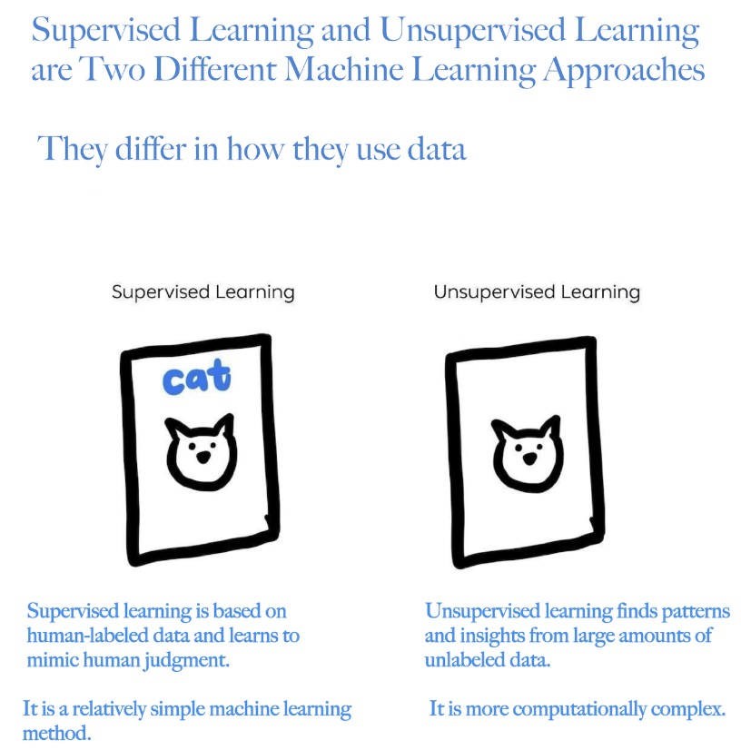
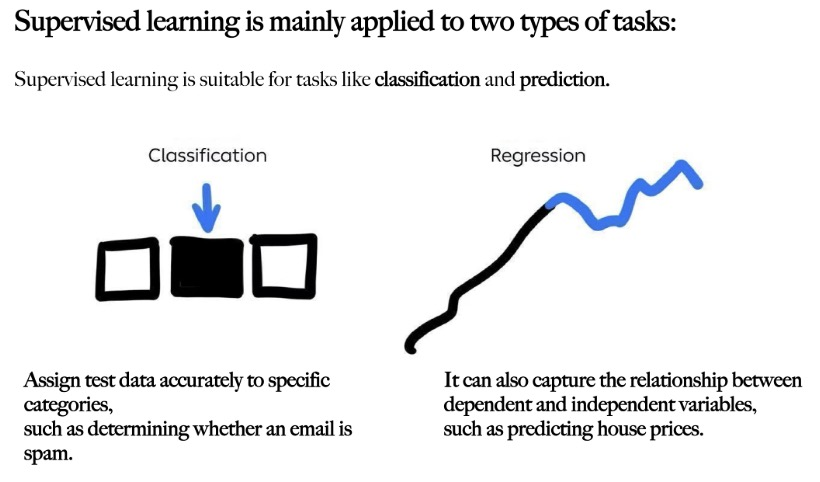
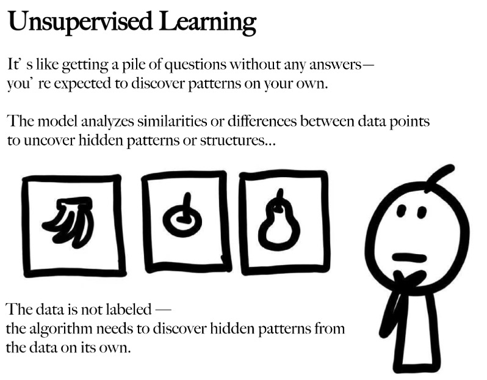
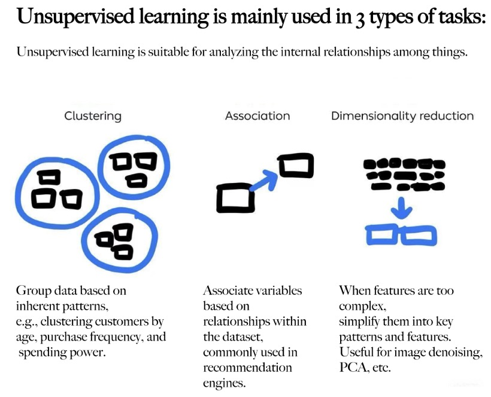
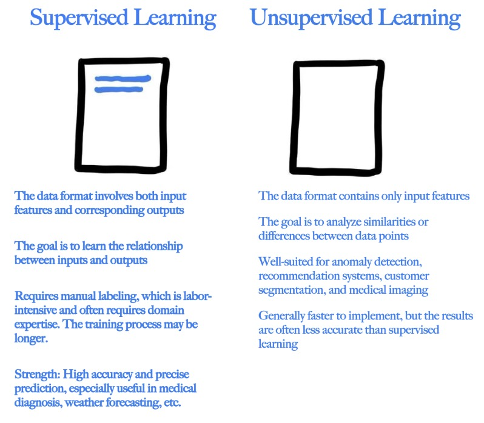

# **INDE577_Machine_Learning_2025_Rice_University**

My name is Alex (Yanzhen) Xu ([ax23@rice.edu](mailto:ax23@rice.edu)), and I am currently a PhD student at the University of Houston. This repository contains code assignments and projects for the course INDE577, Data Science and Machine Learning at Rice University, taught by Dr. Randy Davila. 

In this course, I have studied and implemented **SUPERVISED LEARNING** and **UNSUPERVISED LEARNING**.

This GitHub repository includes both the models **I independently built for SUPERVISED LEARNING and UNSUPERVISED LEARNING, as well as a group package project developed in collaboration with Alice (Yichun) Wang, located in the rice_ml directory.**

## **SUPERVISED LEARNING:**
Supervised learning is a fundamental branch of machine learning in which models are trained on labeled datasets. Each training example includes both input features and a corresponding output label. The model learns to map inputs to outputs, allowing it to make accurate predictions on new data.

In supervised learning, we "teach" the model using answers (labels), much like giving it an answer key. The machine learns to replicate human-like decision making. The better the labeling, the better the model performs.

It is typically applied in two types of tasks:
- Classification: Assign inputs into discrete categories (e.g., spam or not spam)
- Regression: Predict continuous values (e.g., house prices)

## **UNSUPERVISED LEARNING:**
Unsupervised learning analyzes datasets without labeled outputs. The goal is to discover hidden patterns or structures within the data. It is especially useful when labels are unavailable. The model must rely solely on similarities or differences between data points.

Unsupervised learning is commonly used for:
- Clustering: Grouping similar data points together (e.g., customer segmentation)
- Association: Finding relationships between features (e.g., market basket analysis)
- Dimensionality Reduction: Reducing the number of input variables for simplicity and performance (e.g., PCA)

## **SUPERVISED LEARNING vs.UNSUPERVISED LEARNING:**

---

---

---

---

---

## **NOTE:**
Each folder in this repository corresponds to one algorithm. Stay tuned as I continue expanding this repository!

## **REFERENCE:**
Rednote: badbotAI
