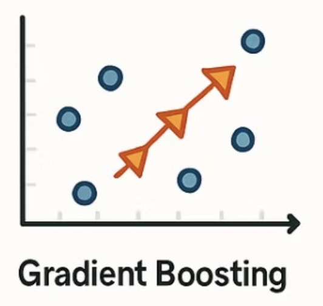
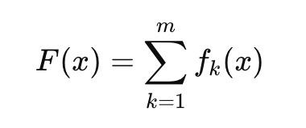
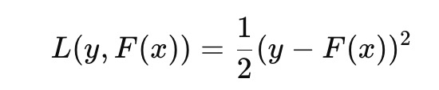
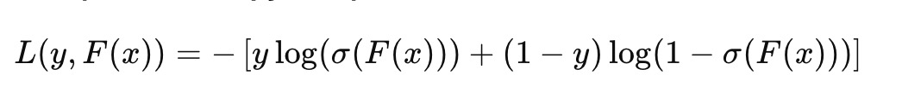
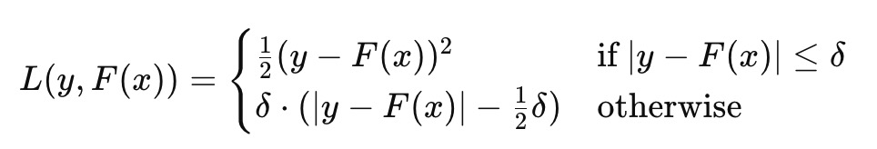
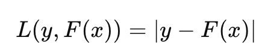

# 🌲 Gradient Boosting

## 📚 Overview

**Gradient Boosting** is a powerful ensemble learning technique based on boosting. It is widely used for both classification and regression tasks in supervised learning. GBM works by combining multiple weak learners (typically decision trees) in a stage-wise fashion to form a strong learner.

---

## 🔍 Core Idea: Additive Model

Assume the target function \( F(x) \) can be represented as a sum of simple base learners \( f_k(x) \):

Each learner is trained sequentially to **minimize the loss** with respect to the current residuals (errors from the previous stage).

---

## 🎯 Loss Function Minimization

At each step \( m \), the model fits a new learner \( f_m(x) \) to the negative gradient of the loss function, gradually reducing prediction errors.

### Common loss functions:

- **Mean Squared Error (MSE)** — for regression tasks

- **Log Loss** — for binary classification

- **Huber Loss**

- **Least Absolute Deviations (L1 Loss))**

---

## 📉 Gradient Descent in Function Space

Instead of adjusting weights in parameter space, Gradient Boosting performs gradient descent **in function space** — updating models by minimizing the loss function iteratively.

---

## 🏗️ Model Structure

- **Base learners**: Most often decision trees (especially CART)
- **Additive model**: Each new tree corrects the errors of the sum of previous trees

---

## ⚙️ Hyperparameter Tuning

Key hyperparameters to tune:

- `n_estimators`: Number of boosting stages
- `max_depth`: Maximum depth of each tree
- `learning_rate`: Shrinkage factor to control contribution of each tree
- `alpha`: Regularization parameter (e.g., L1)

---

## ✅ Advantages

- **High accuracy**: Ensemble learning significantly boosts prediction performance
- **Handles missing data**
- **Strong modeling power for non-linear relationships**

---

## 💼 Common Applications
### Financial services:
- Credit risk scoring
- Default prediction
- Investment strategy modeling

### Insurance:
- Premium estimation
- Claim amount prediction
- Risk-based pricing

### Healthcare:
- Disease diagnosis
- Cost forecasting

### Advertising:
- Click-through rate (CTR) prediction
- Target group segmentation

### E-commerce:
- Product recommendation systems
- Sales forecasting

### Education:
- Dropout prediction
- Learning outcome prediction

---

## 🧾 Conclusion

Gradient Boosting is one of the most effective and widely used ensemble learning techniques in modern machine learning. With its powerful predictive capabilities and flexible model structure, it is an indispensable tool in real-world data science projects.

Reference:
Rednote: 94116033432
