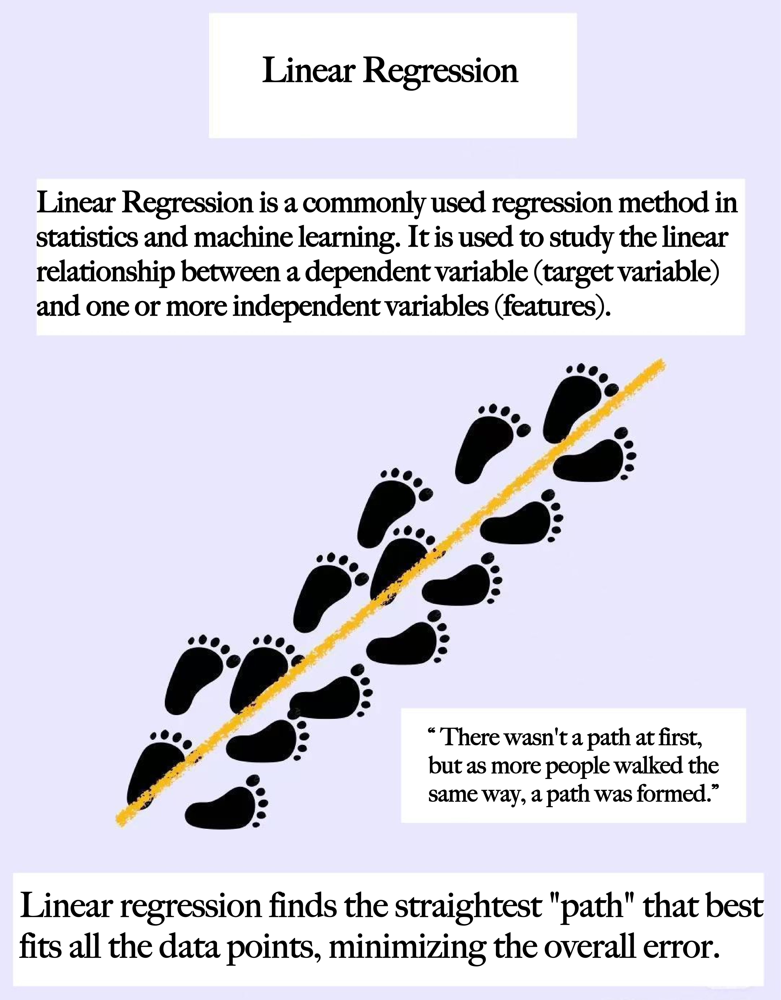
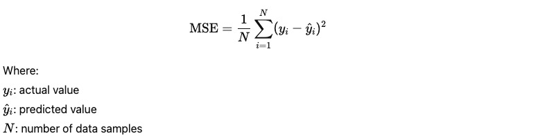

**Core Concepts**

**1. Assume a Linear Relationship:**

There exists a linear relationship between the dependent variable 𝑦 and the independent variable 𝑥.
In other words, the output is a weighted linear combination of the input features.

**2. Minimize the Error:**
The model aims to minimize the difference between the predicted values and the actual values.
This is typically done by minimizing the Mean Squared Error (MSE) to find the optimal regression coefficients:

**3. Strong Interpretability:**
Each regression coefficient indicates how much a particular input feature contributes to the output,
including the direction of the relationship (positive/negative correlation).

