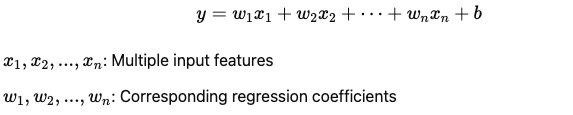

**Core Concepts**

**1. Assume a Linear Relationship:**

There exists a linear relationship between the dependent variable 𝑦 and the independent variable 𝑥.
In other words, the output is a weighted linear combination of the input features.

**2. Minimize the Error:**
The model aims to minimize the difference between the predicted values and the actual values.
This is typically done by minimizing the Mean Squared Error (MSE) to find the optimal regression coefficients:

**3. Strong Interpretability:**
Each regression coefficient indicates how much a particular input feature contributes to the output,
including the direction of the relationship (positive/negative correlation).

**4. Mathematical Formulas**
**Simple Linear Regression (with one independent variable):**

**𝑦 = 𝑤𝑥 + 𝑏**

x: Independent variable (input feature)
(Note: x can be raw input data or transformed features of the input data)
y: Dependent variable (target/predicted value)
w: Regression coefficient (weight/slope)
b: Bias term (intercept)

**Multiple Linear Regression (with multiple independent variables):**

The goal of linear regression is to find the optimal parameters (w and b) so that the model can best fit the training data.

