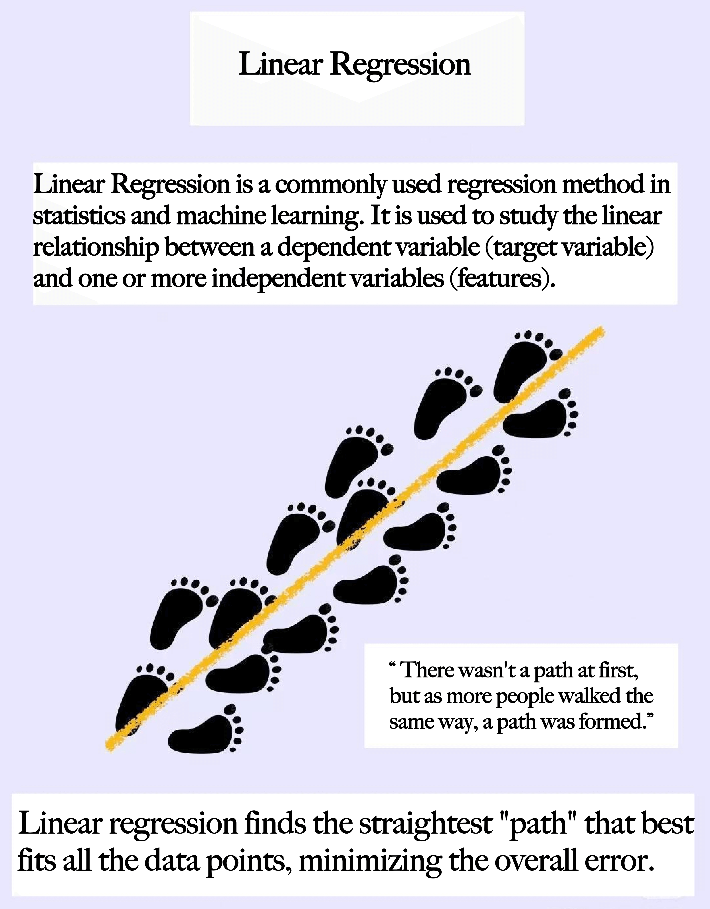
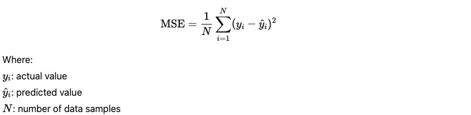

# Linear Regression

A project demonstrating the key concepts, mathematical formulations, and implementation of linear regression models.

---

## 📚 Core Concepts

### 1. Assume a Linear Relationship
There exists a linear relationship between the dependent variable \( y \) and the independent variable(s) \( x \).  
In other words, the output is a weighted linear combination of the input features.

---

### 2. Minimize the Error
The model aims to minimize the difference between the predicted values and the actual values.  
This is typically achieved by minimizing the **Mean Squared Error (MSE)**.

---

### 3. Strong Interpretability
Each regression coefficient reflects how much a particular input feature contributes to the output,  
including the direction of the relationship (positive/negative correlation).

---

## 🧮 Mathematical Formulas

### Simple Linear Regression (with one independent variable)

\[
y = wx + b
\]

- \( x \): Independent variable (input feature)
- \( y \): Dependent variable (target/predicted value)
- \( w \): Regression coefficient (weight/slope)
- \( b \): Bias term (intercept)

---

### Multiple Linear Regression (with multiple independent variables)

The goal is to find the optimal parameters \( w \) and \( b \)  
to minimize the prediction error on the training data.

---

## 📎 Reference

- [Linear Regression - Wikipedia](https://en.wikipedia.org/wiki/Linear_regression)
- Rice University - INDE577 Machine Learning Course Materials
