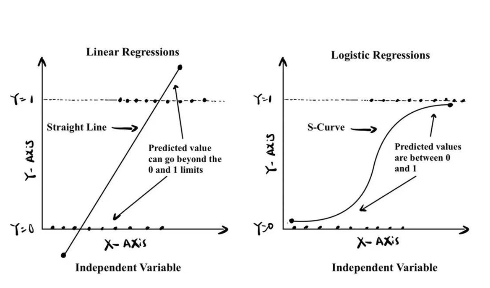
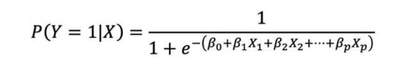
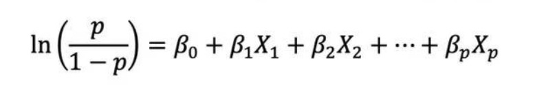

# 🔍 Logistic Regression

---

## Files Included

| File | Description |
|:---|:---|
| `Logistic_regression.ipynb` | Jupyter notebook with full implementation of Logistic Regression |
| `student_depression_dataset.csv` | Dataset used for model training and testing |

---

## How to Run
1. Clone the repository.
2. Logistic_regression.ipynb` in Jupyter Notebook.
3. Run all the cells step-by-step to reproduce the results.

---

## Core Concepts

**Logistic Regression** is a widely used classification method in statistics and machine learning, especially for **binary classification** tasks. 

Despite its name including the word "regression", it is fundamentally a **classification** algorithm. The figure below illustrates the fundamental difference between **Linear Regression** and **Logistic Regression** when applied to binary classification problems:

- **Left Panel (Linear Regression)**: Predicts values as a straight line, which can go beyond the [0, 1] range. This is problematic when modeling probabilities.
- **Right Panel (Logistic Regression)**: Uses an S-shaped curve (sigmoid function) that naturally bounds predicted values between 0 and 1, making it suitable for interpreting as probabilities.

Unlike linear regression, which can produce outputs outside of the [0, 1] range, logistic regression uses the logistic (sigmoid) function to bound predicted values between 0 and 1, representing the probability of an event occurring.

---

## How Logistic Regression Works

Logistic regression estimates the **probability** of a binary outcome based on input features.  
The logistic function is defined as:

Taking the log-odds:

- The model parameters are estimated using **Maximum Likelihood Estimation (MLE)**.
- The predicted probability is converted into class labels using a **threshold** (commonly 0.5).

## Summary
Logistic Regression is:
- Simple yet powerful for binary classification
- Probabilistic and interpretable
- Extensible to multiple classes (multinomial logistic regression)

## Reference 
- Rednote: 2875453178

