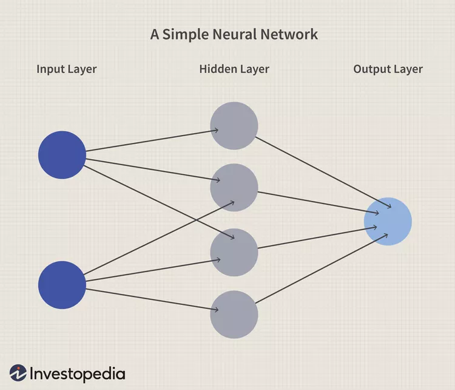
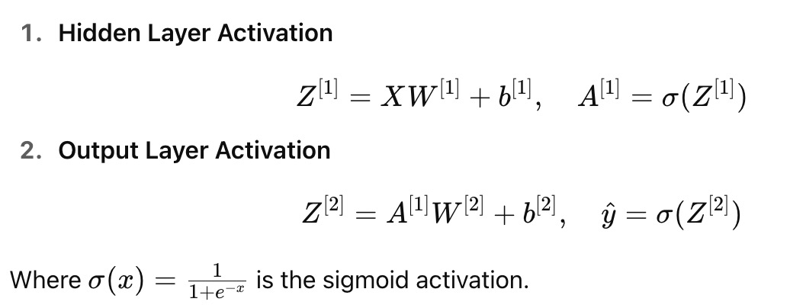

# 🌐 Neural Network

---

## 📊 Files Included

| File | Description |
|:---|:---|
| `Neural_networks.ipynb` | Jupyter notebook with full implementation of Neural Networks |
| `student_depression_dataset.csv` | Dataset used for model training and testing |

---

## 🛠️ How to Run
1. Clone the repository.
2. Neural_networks.ipynb` in Jupyter Notebook.
3. Run all the cells step-by-step to reproduce the results.

---

The diagram above illustrates a basic **feedforward neural network**. It consists of:
- **Input Layer**: Receives raw features (e.g., age, CGPA, sleep hours, etc.).
- **Hidden Layer**: Transforms input signals using learned weights and nonlinear activations (e.g., sigmoid).
- **Output Layer**: Produces the final prediction (in this case, the probability of depression).

## 🧠 Mathematical Formulation
For a single-hidden-layer neural network:

## 🎯 Why Neural Networks?
Can capture complex non-linear relationships.

Handles both numeric and categorical features well.

Works effectively with behavioral and survey-type data like this depression dataset.

