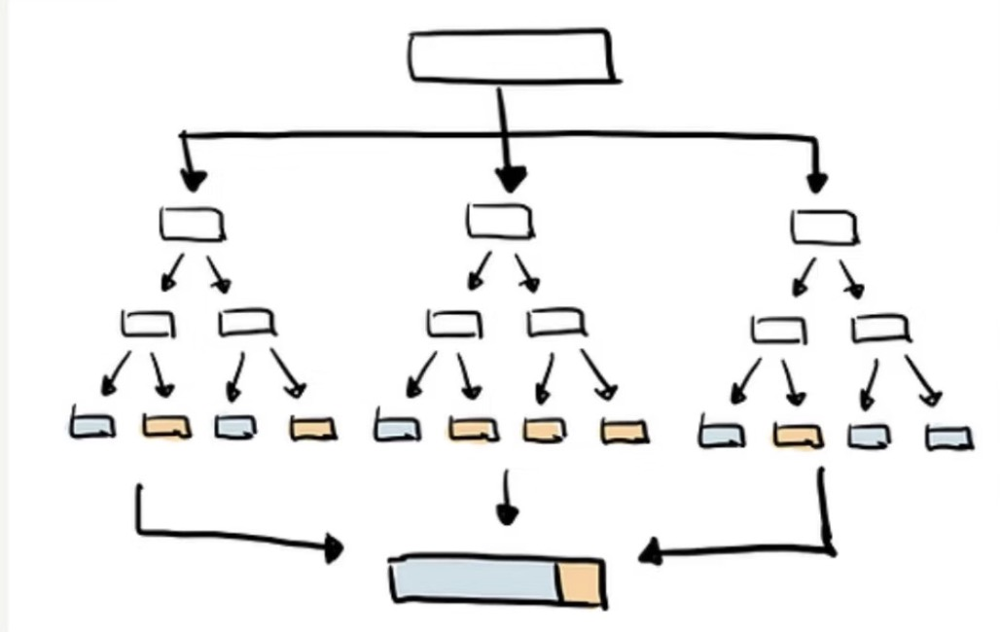

# 🌲 Random Forest: A Powerful Ensemble Learning Algorithm

## 🔍 What is Random Forest?

Random Forest is an ensemble learning algorithm that builds multiple decision trees and combines their outputs. Each tree gives a prediction, and the forest makes the final decision by majority vote (for classification) or averaging (for regression).

Think of it like consulting multiple experts—each may have their own perspective, and the final answer is based on a collective decision.

---

## ❓ Why Use Multiple Trees?

One tree can easily be biased or overfit. But when you train many trees on different subsets of the data and features, each brings unique insights. By combining their results, the overall prediction becomes more stable and accurate.

---

## 🌲 How is the "Forest" Built?
1. **Bootstrap Sampling**: Each tree is trained on a random subset of the data (with replacement).
2. **Random Feature Selection**: At each split in a tree, a random subset of features is considered for splitting, not all of them.
3. **Tree Construction**: Repeat the above steps to grow many trees, then aggregate their predictions.

---

## Formula:  

---

## Where is the Randomness?

- **Random Data**: Each tree uses a different bootstrap sample.
- **Random Features**: Each split considers a random subset of features.

This randomness makes each tree slightly different, helping reduce overfitting and improve generalization.

---

## 💡 Why is Random Forest So Popular?

- ✅ **High Accuracy**: Ensemble of multiple trees usually outperforms a single decision tree.
- 🛠️ **Easy to Use**: It works well even with minimal hyperparameter tuning.
- ⚙️ **Parallelizable**: Trees are built independently, making it easy to train on large datasets.

---

## 🧠 Summary

Random Forest combines the strengths of many decision trees to create a high-performance model. Whether you're a beginner or experienced in machine learning, Random Forest is a must-try algorithm for both classification and regression tasks.

