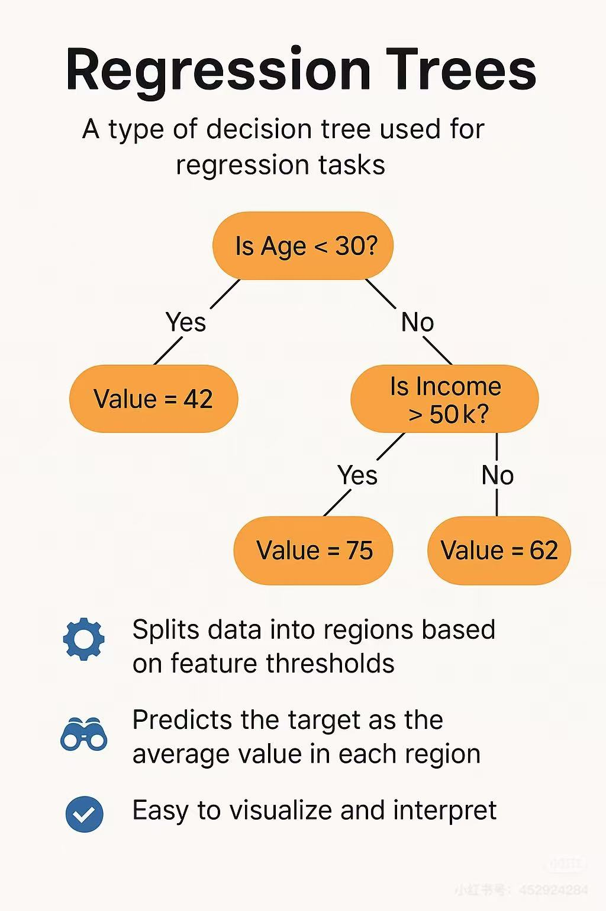

# 🌲 Regression Trees

A project demonstrating the key concepts, structure, and applications of regression trees.

If images fail to load, please refer to `README.ipynb` for a complete version with embedded visuals.

---

## 📚 Core Concepts

A **Regression Tree** is a type of decision tree used to predict continuous numerical outcomes by recursively splitting the data into smaller groups based on input features.

---

## 🧠 How Regression Trees Work

Regression Trees work by:

- **Start with All Data**: Begin with the whole dataset at the root.
- **Find the Best Split**: Choose a feature and a split point that minimizes the prediction error (e.g., MSE).
- **Repeat for Each Branch**: Keep splitting until a stopping rule is met (such as minimum number of samples or maximum depth).
- **Make Predictions**: Predict by averaging the values in the final (leaf) nodes.

Common use cases include:

- House price prediction
- Predicting loan amounts
- Forecasting sales
- Estimating health outcomes

---

## 🌳 Simple Example

Below is a simple regression tree example:

- First split: "Is Age < 30?"
- If No: then "Is Income > 50k?"

Each final leaf predicts an average target value.

---

# Summary

Regression Trees are easy to interpret, capable of modeling complex non-linear relationships, and form the basis for more powerful ensemble models like Random Forests and Gradient Boosting.

---
