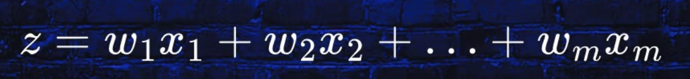

# 🧠 Perceptron Model

This repository introduces the **Perceptron Model**, a fundamental algorithm for binary classification tasks in machine learning. It is the building block for more complex models such as neural networks.

---

## 📌 Overview

The Perceptron receives multiple inputs, applies weights and bias, and produces a binary output using a threshold-based activation function.

---

## ⚙️ Key Components

### 1. Inputs and Weights

Each input feature \( x_i \) is multiplied by a corresponding weight \( w_i \). The weighted sum is calculated as:

This operation determines how much influence each input has on the output.

---

### 2. Decision Function

After calculating the weighted sum \( z \), the model applies a step function to decide the output class:

\[
\sigma(z) =
\begin{cases}
1 & \text{if } z \geq \theta \\
0 & \text{if } z < \theta
\end{cases}
\]

Where \( \theta \) is a manually defined threshold.

---

### 3. Simplification with Bias

To simplify the model, we define a bias term \( b = -\theta \), and the formula becomes:

\[
z = w_1x_1 + w_2x_2 + \cdots + w_mx_m + b
\]

This helps make the threshold part of the learned parameters during training.

---

## ✅ Final Representation

Putting it all together, the final Perceptron model is represented as:

\[
z = \sum_{i=1}^{n} w_i x_i + b
\quad
\sigma(z) =
\begin{cases}
1 & \text{if } z \geq 0 \\
0 & \text{if } z < 0
\end{cases}
\]

This function outputs 1 or 0 based on whether the input passes the learned decision boundary.

---

## 🔁 Functional Architecture

The Perceptron structure includes:

1. A **weighted summation** of inputs
2. Addition of a **bias**
3. Application of an **activation function** (step function)

---
