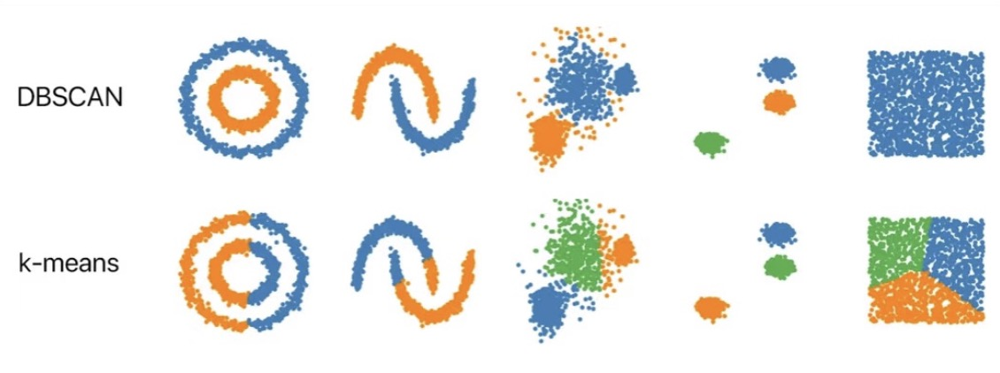
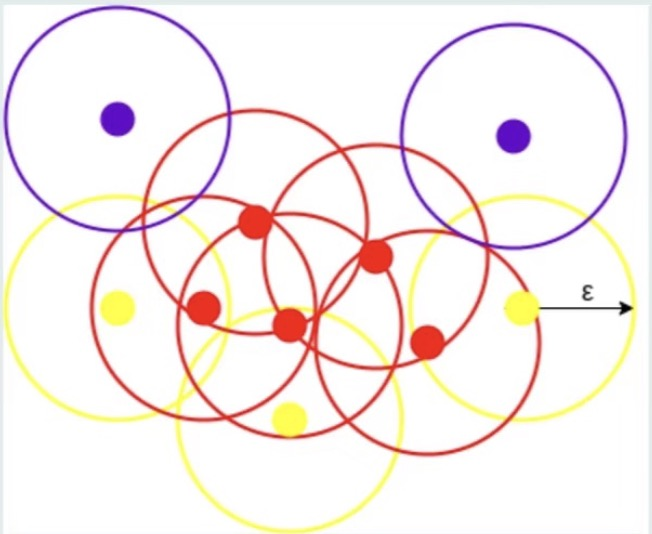
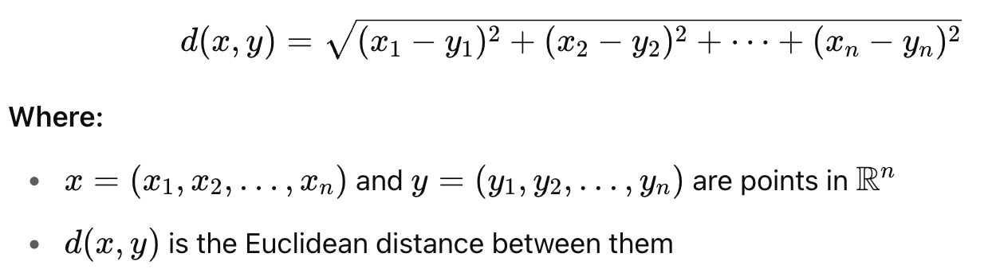
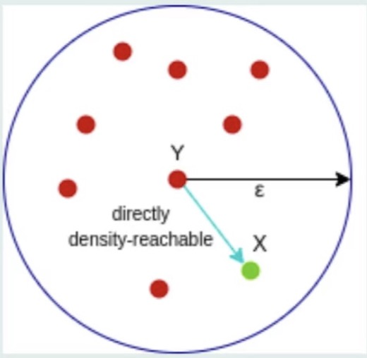
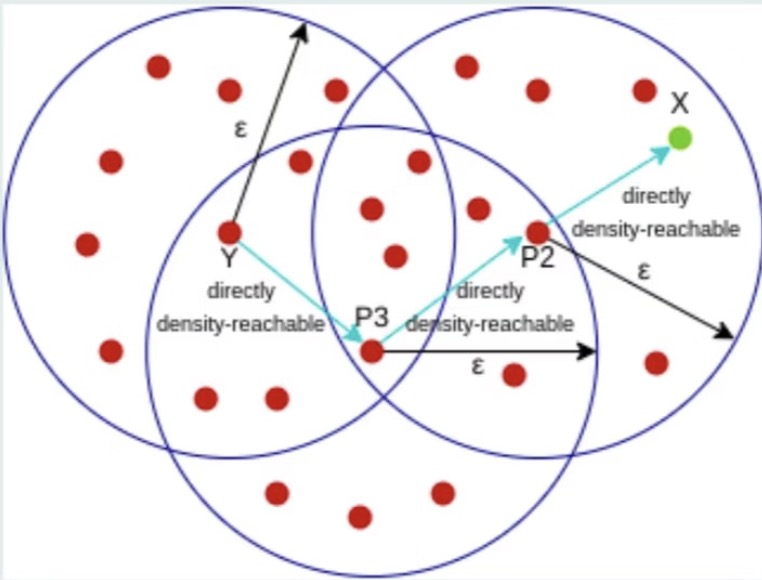

# DBSCAN

---

## Files Included

| File | Description |
|:---|:---|
| `DBSCAN.ipynb` | Jupyter notebook with full implementation of DBSCAN |
| `fashion-mnist_test.csv` | The dataset consists of two files: fashion-mnist_train.csv and fashion-mnist_test.csv. However, due to the large file size of the training set, it is not uploaded to this GitHub repository. **For full dataset**, please refer to [Fashion MNIST dataset](https://www.kaggle.com/datasets/zalando-research/fashionmnist?select=fashion-mnist_train.csv)|

---

## Dataset Overview

The dataset used is the Fashion MNIST dataset, provided by Zalando Research. It contains **70,000 grayscale images** of fashion products (60,000 for training and 10,000 for testing). Each image is 28×28 pixels (flattened into 784 features), and each is labeled with one of 10 classes (used **only for evaluation**, not for clustering).

- **Total Examples**: 70,000  
- **Image Size**: 28 × 28 pixels → 784 pixels in total  
- **Labels (not used in training)**:  
  - 0: T-shirt/top  
  - 1: Trouser  
  - 2: Pullover  
  - 3: Dress  
  - 4: Coat  
  - 5: Sandal  
  - 6: Shirt  
  - 7: Sneaker  
  - 8: Bag  
  - 9: Ankle boot

---

## How to Run
1. Clone the repository.
2. DBSCAN.ipynb` in Jupyter Notebook.
3. Run all the cells step-by-step to reproduce the results.

---

## Introduction

This repository implements the **DBSCAN (Density-Based Spatial Clustering of Applications with Noise)** algorithm in Python. DBSCAN is a powerful density-based clustering method especially effective in identifying arbitrarily shaped clusters and dealing with noisy data.

---

## What is DBSCAN?

DBSCAN groups together points that are closely packed together (points with many nearby neighbors), marking as outliers the points that lie alone in low-density regions.

By *Martin Ester et al. (1996)*, DBSCAN assumes that clusters are areas of **high density separated by low density**. Unlike K-Means, **DBSCAN does not require the number of clusters (K) to be specified** in advance and is robust to outliers.

---

## Key Concepts & Parameters

DBSCAN requires two parameters:
- **ε (epsilon)**: The radius of the neighborhood around a data point.
- **minPts**: The minimum number of points required to form a dense region (core point).

In high-dimensional data, this ε becomes a **hypersphere**.

---

## 🧠 Core Ideas

Each point is classified as one of the following:

- **Core Point**: Has at least `minPts` points within its ε-neighborhood.
- **Border Point**: Has fewer than `minPts` points in ε-neighborhood but is reachable from a core point.
- **Noise Point**: Not reachable from any core point.

---

## 🧪 How It Works

For each point in the dataset:

1. Count how many points are within ε.
2. If at least `minPts`, label it a **core point**.
3. All points within its ε are **directly density-reachable**.
4. Cluster grows through **density-connected** points.

### 📐 Distance Metric

DBSCAN typically uses **Euclidean distance**:

---

## 📊 Reachability & Connectivity

DBSCAN relies on two key notions:
- **Reachability**: Can a point be reached from another under ε and minPts?
- **Connectivity**: Can two points be linked through a sequence of density-reachable steps?

**Conditions for Direct Density Reachability:**
Point x is directly density-reachable from y if:
- dist(x,y)≤ϵ
- 𝑦 is a core point

For **Density Reachability**:
If a chain \( p_1, p_2, ..., p_n \) exists where each \( p_{i+1} \) is directly density-reachable from \( p_i \), then \( p_n \) is density-reachable from \( p_1 \).

---

## Why Use DBSCAN?
K-Means and Hierarchical Clustering struggle with:
- Non-spherical clusters
- Varying densities
- Noisy data

DBSCAN handles all of the above effectively, making it suitable for tasks like:
- Anomaly detection
- Spatial data mining
- Arbitrary-shape pattern recognition

---

## Reference:
Rednote: 895328393
