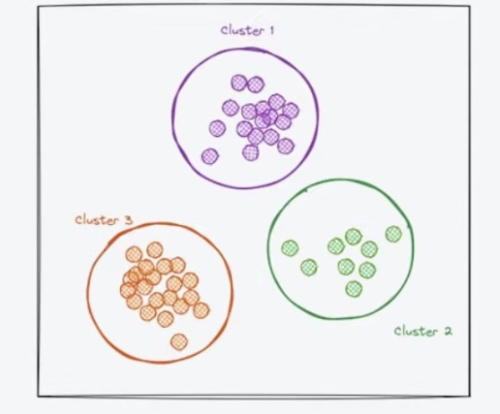
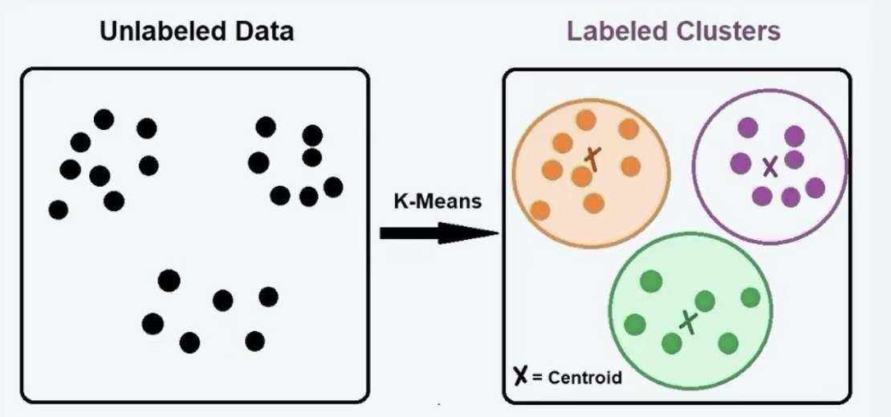
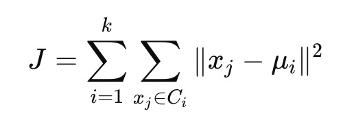
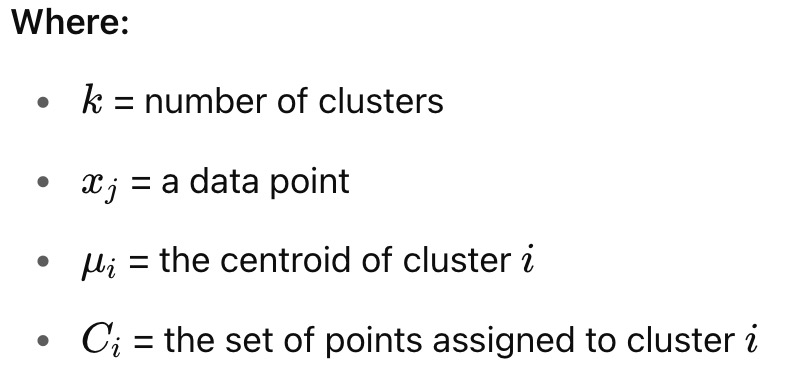
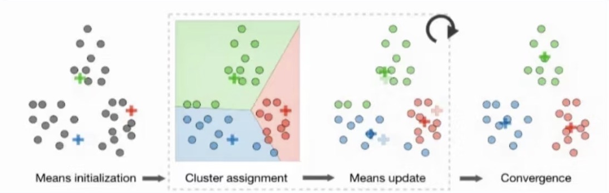
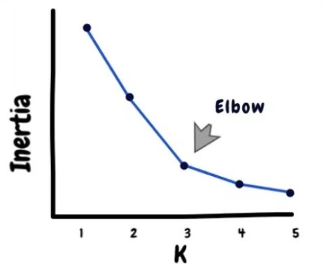

# K-Means Clustering Model

---

## Files Included

| File | Description |
|:---|:---|
| `K_means_clustering.ipynb` | Jupyter notebook with full implementation of K Means Clustering |
| `fashion-mnist_test.csv` | The dataset consists of two files: fashion-mnist_train.csv and fashion-mnist_test.csv. However, due to the large file size of the training set, it is not uploaded to this GitHub repository. **For full dataset**, please refer to [Fashion MNIST dataset](https://www.kaggle.com/datasets/zalando-research/fashionmnist?select=fashion-mnist_train.csv)|

## Dataset Overview

The dataset used is the Fashion MNIST dataset, provided by Zalando Research. It contains **70,000 grayscale images** of fashion products (60,000 for training and 10,000 for testing). Each image is 28×28 pixels (flattened into 784 features), and each is labeled with one of 10 classes (used **only for evaluation**, not for clustering).

- **Total Examples**: 70,000  
- **Image Size**: 28 × 28 pixels → 784 pixels in total  
- **Labels (not used in training)**:  
  - 0: T-shirt/top  
  - 1: Trouser  
  - 2: Pullover  
  - 3: Dress  
  - 4: Coat  
  - 5: Sandal  
  - 6: Shirt  
  - 7: Sneaker  
  - 8: Bag  
  - 9: Ankle boot  

---

## How to Run
1. Clone the repository.
2. K_means_clustering.ipynb` in Jupyter Notebook.
3. Run all the cells step-by-step to reproduce the results.

---

## Introduction
This project implements the **K-Means Clustering** algorithm using Python and applies it to a large-scale dataset. The goal is to group unlabeled data into K distinct clusters based on feature similarity.

> Due to the large size of the full dataset, **this repository only includes the test set**. For the complete dataset, please refer to the link provided inside the Python code file.

---

## What is Clustering?
Clustering is a type of **unsupervised learning** algorithm that groups similar data points into clusters without needing labeled data.

Applications include:
- User segmentation (e.g., personalized ads, news grouping)
- Image segmentation & compression
- Data reduction and anomaly detection

---

## What is K-Means?
K-Means is a basic but powerful clustering algorithm. It aims to partition `n` observations into `K` clusters where each observation belongs to the cluster with the nearest mean (centroid).

---

## Mathematical Objective:

Minimize the **within-cluster sum of squared distances (WCSS)**:

---

## K-Means Algorithm Steps

1. **Initialization**: Randomly select K data points as initial centroids.
2. **Cluster Assignment**: Assign each point to the nearest centroid based on Euclidean distance.
3. **Update Step**: Recalculate centroids as the mean of the points in each cluster.
4. **Repeat**: Steps 2–3 until convergence (no change in centroids or cluster assignments).

---

## Choosing the Value of K

### Common Methods:
**Elbow Method**: Choose K at the “elbow” point where WCSS no longer decreases significantly.

---

## Advantages

- **Simple** and intuitive.
- **Fast** for datasets with a relatively small number of features.
- **Scalable** to large datasets with efficient implementations.

---

## Reference:
Rednote: 192052443
