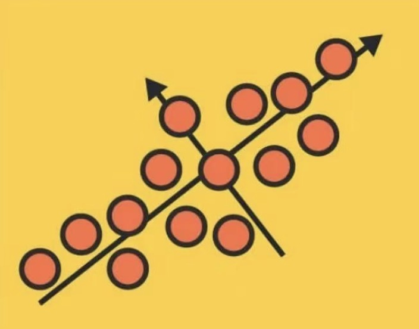
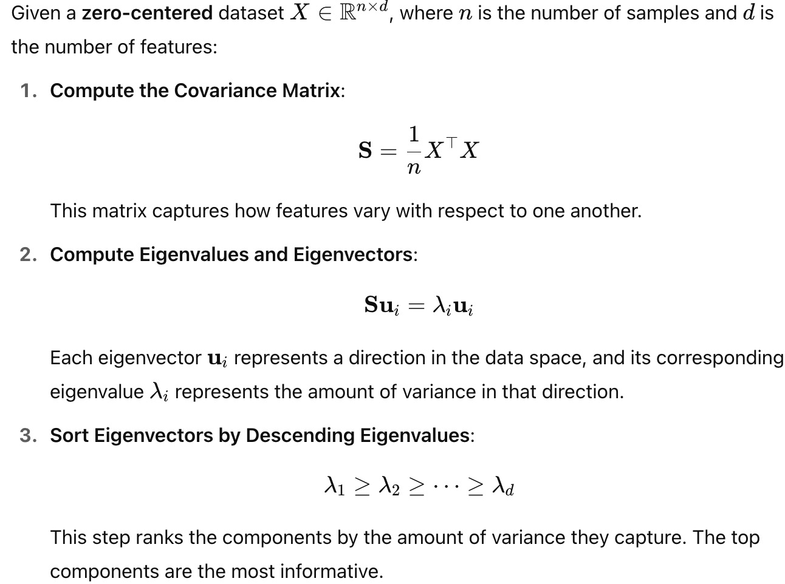
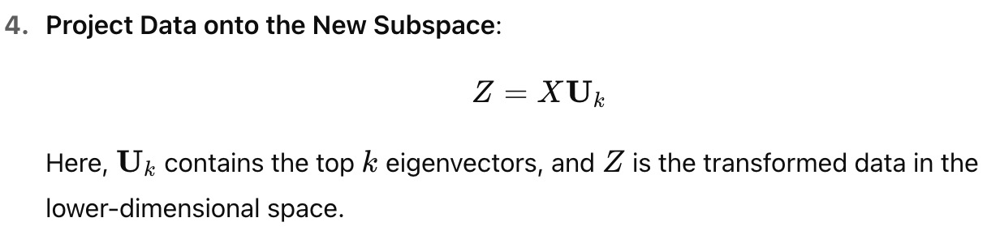
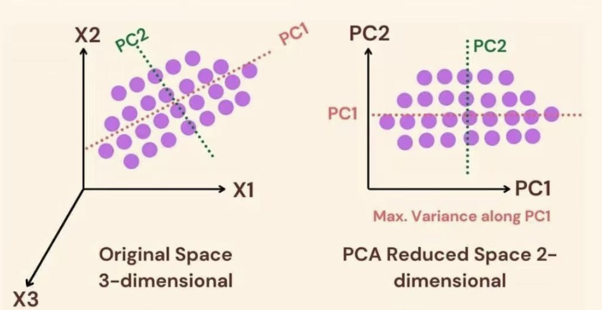
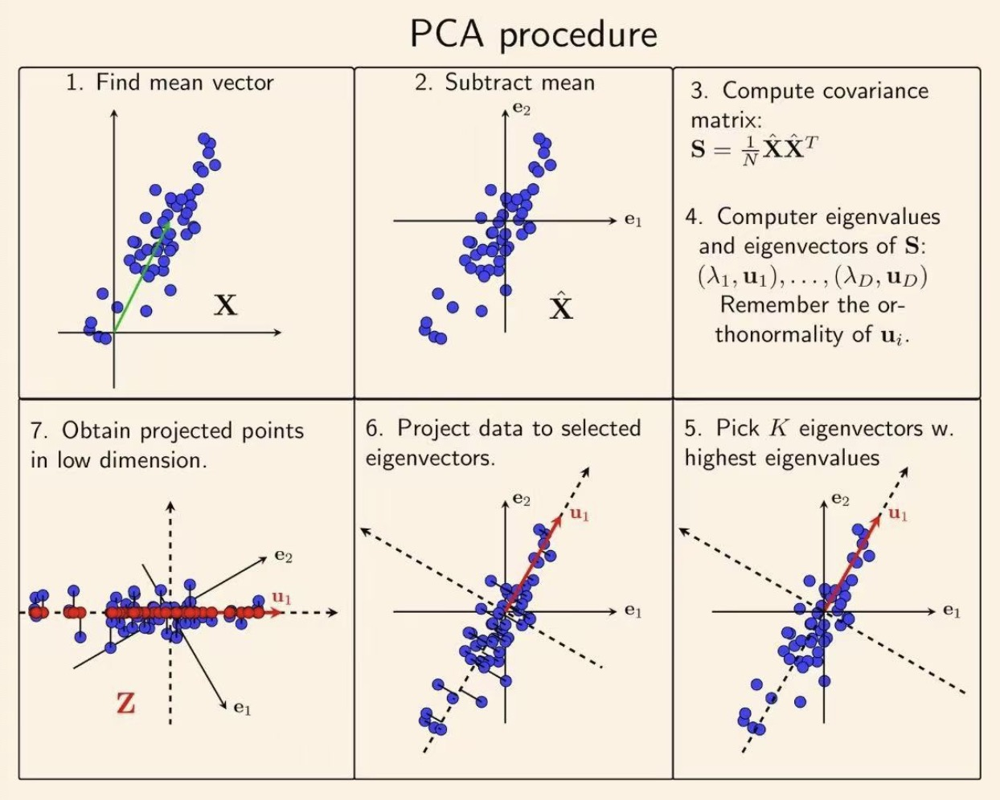

# Principal Component Analysis (PCA)

## Files Included

| File | Description |
|:---|:---|
| `Principal_component_analysis.ipynb` | Jupyter notebook with full implementation of Principal Component Analysis |
| `fashion-mnist_test.csv` | The dataset consists of two files: fashion-mnist_train.csv and fashion-mnist_test.csv. However, due to the large file size of the training set, it is not uploaded to this GitHub repository. **For full dataset**, please refer to [Fashion MNIST dataset](https://www.kaggle.com/datasets/zalando-research/fashionmnist?select=fashion-mnist_train.csv)|

---

## Dataset Overview

The dataset used is the Fashion MNIST dataset, provided by Zalando Research. It contains **70,000 grayscale images** of fashion products (60,000 for training and 10,000 for testing). Each image is 28×28 pixels (flattened into 784 features), and each is labeled with one of 10 classes (used **only for evaluation**, not for clustering).

- **Total Examples**: 70,000  
- **Image Size**: 28 × 28 pixels → 784 pixels in total  
- **Labels (not used in training)**:  
  - 0: T-shirt/top  
  - 1: Trouser  
  - 2: Pullover  
  - 3: Dress  
  - 4: Coat  
  - 5: Sandal  
  - 6: Shirt  
  - 7: Sneaker  
  - 8: Bag  
  - 9: Ankle boot
 
  ---

## How to Run
1. Clone the repository.
2. Principal_component_analysis.ipynb` in Jupyter Notebook.
3. Run all the cells step-by-step to reproduce the results.

---

## What is PCA?

Principal Component Analysis (PCA) is one of the most widely used **dimensionality reduction** techniques. It transforms high-dimensional data into a lower-dimensional feature space while preserving as much **variance** as possible.

PCA identifies new axes, called **principal components**, that are linear combinations of the original variables. These components are uncorrelated and ordered by the amount of variance they capture.

---

## Mathematical Formulation

---

## PCA Procedure

---

## Why Use PCA?
- **Noise Reduction**: Filter out noise to highlight key structure.
- **Visualization**: Project high-dimensional data into 2D/3D space.
- **Efficiency**: Reduce model complexity and training time.
- **Improve Performance**: Remove irrelevant or redundant features.

---

## Real-World Applications

- **Image Processing**: Feature extraction, denoising, compression.
- **Finance**: Portfolio optimization, risk modeling.
- **Bioinformatics**: Disease gene prediction, genome analysis.

---

## Reference
Rednote: 192052443
