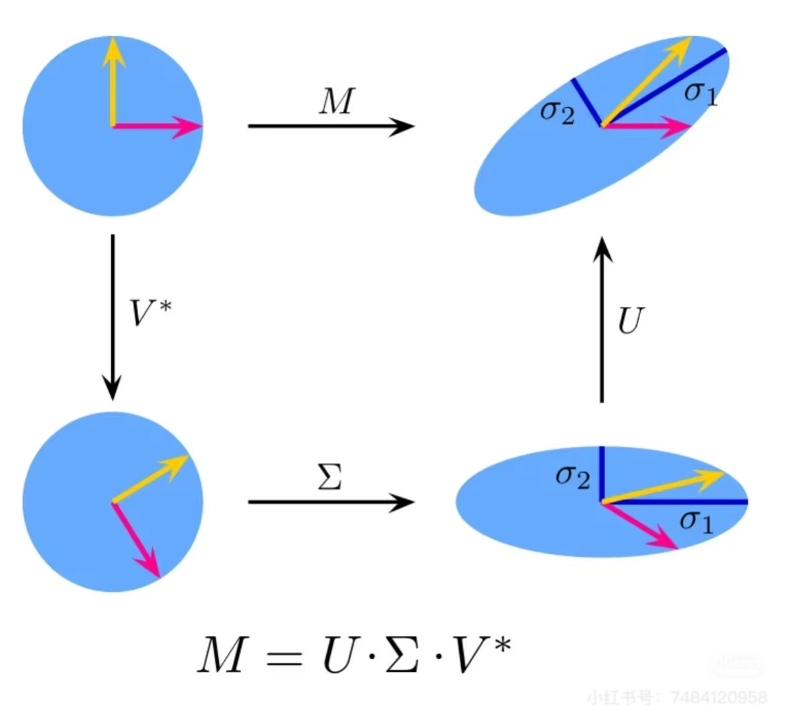
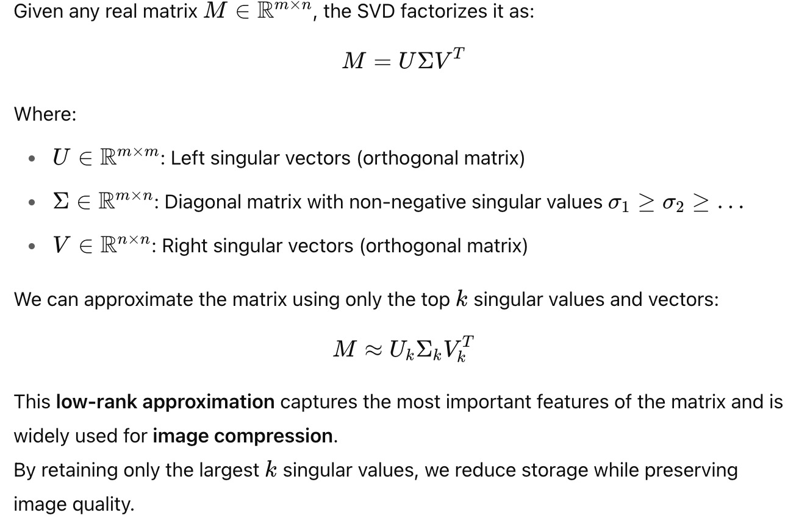

# Image Compression with the Singular Value Decomposition (SVD)

---

## What is SVD

- The input matrix \( M \) maps a circle into an ellipse.
- This is broken down into three steps:
- Rotation by \( V^* \)
- Scaling via singular values \( \Sigma \)
- Final rotation by \( U \)

---

## Mathematical Formulation

---

## Why it works

SVD compresses an image by keeping the most "important" directions (those with highest variance) in the data. Visually, it transforms the image through three steps:
1. Rotate to align with principal directions: \( V^T \)
2. Scale along singular directions: \( \Sigma \)
3. Rotate to the output basis: \( U \)

---

## Image Compression Demo
In practice, we:

1. Apply SVD to the image matrix
2. Keep only top \( k \) singular values (e.g., \( k = 20, 50, 100 \))
3. Reconstruct the image with:

This saves memory and achieves high-quality approximation.

---
