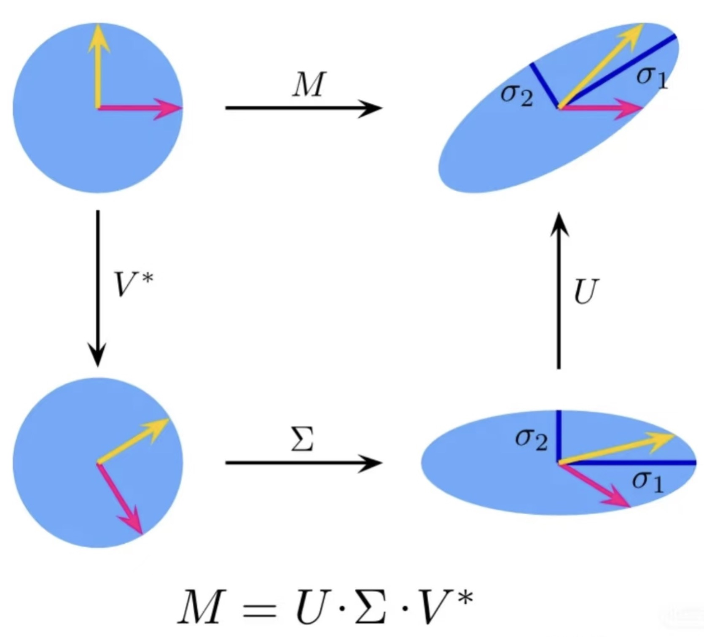

# Image Compression with the Singular Value Decomposition (SVD)

---

| File | Description |
|:---|:---|
| `DBSCAN.ipynb` | Jupyter notebook with full implementation of DBSCAN |
| `fashion-mnist_test.csv` | The dataset consists of two files: fashion-mnist_train.csv and fashion-mnist_test.csv. However, due to the large file size of the training set, it is not uploaded to this GitHub repository. **For full dataset**, please refer to [Fashion MNIST dataset](https://www.kaggle.com/datasets/zalando-research/fashionmnist?select=fashion-mnist_train.csv)|

---

## Dataset Overview

The dataset used is the Fashion MNIST dataset, provided by Zalando Research. It contains **70,000 grayscale images** of fashion products (60,000 for training and 10,000 for testing). Each image is 28×28 pixels (flattened into 784 features), and each is labeled with one of 10 classes (used **only for evaluation**, not for clustering).

- **Total Examples**: 70,000  
- **Image Size**: 28 × 28 pixels → 784 pixels in total  
- **Labels (not used in training)**:  
  - 0: T-shirt/top  
  - 1: Trouser  
  - 2: Pullover  
  - 3: Dress  
  - 4: Coat  
  - 5: Sandal  
  - 6: Shirt  
  - 7: Sneaker  
  - 8: Bag  
  - 9: Ankle boot

---

## How to Run
1. Clone the repository.
2. Singular_value_decomposition.ipynb` in Jupyter Notebook.
3. Run all the cells step-by-step to reproduce the results.

---

## What is SVD?

- The input matrix \( M \) maps a circle into an ellipse.
- This is broken down into three steps:
- Rotation by \( V^* \)
- Scaling via singular values \( \Sigma \)
- Final rotation by \( U \)

---

## Mathematical Formulation

---

## How it works?

SVD compresses an image by keeping the most "important" directions (those with highest variance) in the data. Visually, it transforms the image through three steps:
1. Rotate to align with principal directions: \( V^T \)
2. Scale along singular directions: \( \Sigma \)
3. Rotate to the output basis: \( U \)

---

## Image Compression
In practice, we:

1. Apply SVD to the image matrix
2. Keep only top \( k \) singular values (e.g., \( k = 20, 50, 100 \))
3. Reconstruct the image with:

This saves memory and achieves high-quality approximation.

---

## Reference:
Rednote: 7484120958
